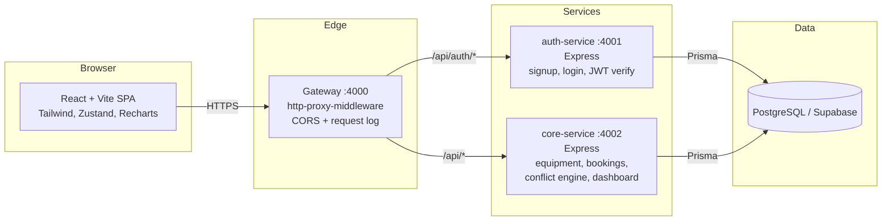
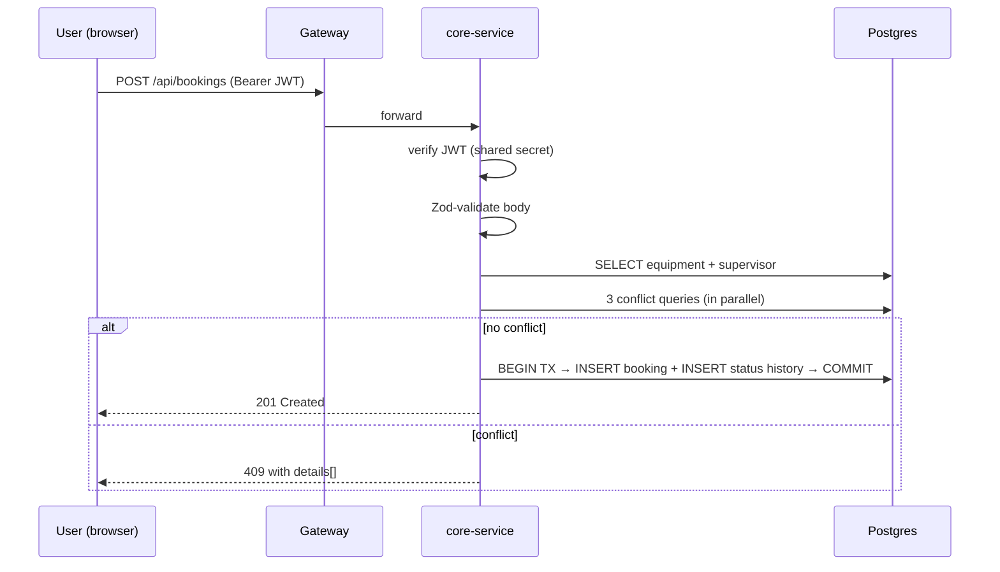

# LabLock — Architecture

## 1. High-level diagram



The frontend never talks to the services directly — everything is proxied through the gateway, which keeps CORS and logging in one place and lets us swap or scale either backend service without touching the SPA.

## 2. Why three Node services and not one

A single monolith would have been faster to write. We split into three because:

1. **Auth has different change frequency.** Once login + signup work, the auth-service barely changes. Putting it behind its own port keeps "one schema = one service" honest and lets us re-deploy core without touching auth.
2. **Course requirement.** The assignment asks for a microservice-style design and a gateway, so this matches the rubric.
3. **Clear blast radius for a beginner.** A bug in the conflict engine cannot accidentally break the login flow.

## 3. Service responsibilities

### Gateway (`gateway/`)
- Single public port (4000)
- Proxies `/api/auth/*` → auth-service
- Proxies all other `/api/*` → core-service
- Adds `X-Request-Id`, logs latency, sets CORS headers
- No business logic, no database connection

### auth-service (`services/auth/`)
- `POST /signup` — Zod-validated body, bcrypt hash, issues JWT
- `POST /login` — verifies password, issues JWT
- `GET /verify` — used internally if needed (core verifies tokens itself with shared `JWT_SECRET`)
- `GET /me` — decodes the bearer token and returns the current user
- Owns its own `User` Prisma client (read-only schema; migrations live in core-service)

### core-service (`services/core/`)
- Equipment CRUD with pagination, search, category filter, "available on date" flag
- Booking CRUD with the **three-way conflict engine**
- Booking state machine (`requested → approved → in_use → returned`, plus `rejected` and `cancelled`)
- Admin dashboard summary
- Lab room list
- Owns the canonical Prisma schema and runs all migrations

### Frontend (`frontend/`)
- Vite + React 18 + Tailwind
- Zustand store (persisted to `localStorage`) for auth state
- Axios client with auth bearer interceptor and 401-auto-logout
- React Router v6 with `<ProtectedRoute>` wrapper for role-aware guards
- Pages: Login, Signup, Equipment list, Equipment detail, My bookings, Admin dashboard, Admin bookings, Admin equipment

## 4. The three-way conflict engine

This is the unique business rule of the project. When a student requests `(equipment, supervisor, [start, end))`, the engine checks all three of these in parallel inside a single function (`services/core/src/lib/conflict.js`):

1. **Equipment self-conflict** — does any active booking on the *same equipment* overlap `[start, end)`?
2. **Supervisor double-booking** — does the supervisor already have an active booking on *any* equipment overlapping `[start, end)`?
3. **Supervisor unavailability** — is the supervisor marked unavailable on that day in `SupervisorAvailability`?

We treat intervals as half-open `[start, end)` so back-to-back bookings (10–11 then 11–12) don't conflict. If any check fails, the API returns `409 Conflict` with a structured `details` array describing which rule fired and which booking caused it. The frontend renders that array as a bulleted error list under the booking form.

The engine is a pure function that takes a Prisma client + params, which means every rule is unit-testable without an HTTP layer.

## 5. State machine

```
requested ──approve──▶ approved ──check-out──▶ in_use ──return──▶ returned
    │                       │
    ├── reject (admin) ─▶ rejected
    └── cancel (self)  ─▶ cancelled
```

Implemented as a pure function `canTransition(from, to, actor)` that consults a transitions table. Every status change writes a row to `BookingStatusHistory` so we have an audit trail.

## 6. Data flow: book a slot (sequence)



## 7. Trade-offs and what we explicitly didn't build

- **No real-time updates.** Admins refresh the queue manually. WebSockets / SSE would be a Phase-2 add.
- **No file uploads** for equipment photos. Out of scope for the rubric.
- **JWT in localStorage**, not httpOnly cookies. Easier for the dev environment, accepts the XSS trade-off given the scope.
- **Soft delete only** for equipment (`isActive=false`). We never hard-delete because old bookings should still resolve their equipment name.
- **One Postgres database** shared by both services. A "true" microservice purist would split databases — we don't, because the auth-service only reads `User` and the operational complexity isn't worth it for an assignment.
