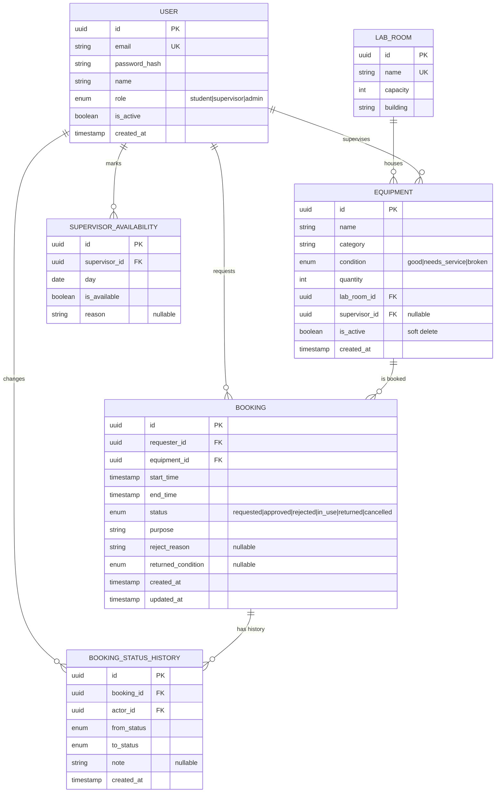

# Database Schema — LabLock

Database: **PostgreSQL 15** (hosted on Supabase free tier).
ORM: **Prisma** (migrations + type-safe queries).

## ER Diagram (Mermaid)



## Table Details

### `user`

| Column | Type | Notes |
|---|---|---|
| `id` | uuid PK | |
| `email` | varchar(120) | unique, lowercase |
| `password_hash` | text | bcrypt, cost 10 |
| `name` | varchar(80) | |
| `role` | enum | `student` / `supervisor` / `admin` |
| `is_active` | boolean | default true |
| `created_at` | timestamptz | default now() |

**Indexes:** `(email)` unique, `(role)` for admin filters.

### `lab_room`

| Column | Type | Notes |
|---|---|---|
| `id` | uuid PK | |
| `name` | varchar(80) | unique (e.g., "EEE Lab 1") |
| `capacity` | int | how many people the room holds |
| `building` | varchar(80) | |

### `equipment`

| Column | Type | Notes |
|---|---|---|
| `id` | uuid PK | |
| `name` | varchar(120) | |
| `category` | varchar(50) | e.g., `oscilloscope`, `3d_printer` |
| `condition` | enum | `good` / `needs_service` / `broken` |
| `quantity` | int | ≥ 1 |
| `lab_room_id` | uuid FK → `lab_room.id` | |
| `supervisor_id` | uuid FK → `user.id` | nullable; only set when supervisor required |
| `is_active` | boolean | soft delete |
| `created_at` | timestamptz | |

**Indexes:** `(category)`, `(lab_room_id)`, `(supervisor_id)`, `(is_active)`.

### `booking`

| Column | Type | Notes |
|---|---|---|
| `id` | uuid PK | |
| `requester_id` | uuid FK → `user.id` | |
| `equipment_id` | uuid FK → `equipment.id` | |
| `start_time` | timestamptz | |
| `end_time` | timestamptz | CHECK `end_time > start_time` |
| `status` | enum | `requested` / `approved` / `rejected` / `in_use` / `returned` / `cancelled` |
| `purpose` | varchar(240) | student's reason |
| `reject_reason` | text | set on `rejected` |
| `returned_condition` | enum | nullable; set on `returned` |
| `created_at` | timestamptz | |
| `updated_at` | timestamptz | |

**Indexes:**
- `(equipment_id, start_time, end_time)` — the conflict-check query relies on this
- `(requester_id, status)` — "my bookings" view
- `(status)` — pending approvals filter

**Key constraint:** the database does not enforce non-overlap (no native EXCLUDE constraint via Prisma). The conflict check is done in application code inside a serializable transaction — this is explicitly a talking point for the reflection report.

### `booking_status_history`

Audit log. One row per transition. Used in the booking detail view and the admin reports.

| Column | Type | Notes |
|---|---|---|
| `id` | uuid PK | |
| `booking_id` | uuid FK → `booking.id` | |
| `actor_id` | uuid FK → `user.id` | who made the change |
| `from_status` | enum | nullable (for creation) |
| `to_status` | enum | |
| `note` | text | nullable |
| `created_at` | timestamptz | |

### `supervisor_availability`

Per-day availability flag for supervisors. A supervisor is assumed available unless a row says otherwise.

| Column | Type | Notes |
|---|---|---|
| `id` | uuid PK | |
| `supervisor_id` | uuid FK → `user.id` | |
| `day` | date | |
| `is_available` | boolean | default true |
| `reason` | text | e.g., "conference" |

**Unique:** `(supervisor_id, day)`.

## Conflict-Check Query (conceptual SQL)

The heart of UC-4. Runs inside a transaction before insert.

```sql
-- 1. Equipment conflict
SELECT id FROM booking
WHERE equipment_id = :equipment_id
  AND status IN ('approved', 'in_use', 'requested')
  AND start_time < :new_end
  AND end_time > :new_start
LIMIT 1;

-- 2. Supervisor conflict (if equipment has a supervisor)
SELECT b.id FROM booking b
JOIN equipment e ON e.id = b.equipment_id
WHERE e.supervisor_id = :supervisor_id
  AND b.status IN ('approved', 'in_use')
  AND b.start_time < :new_end
  AND b.end_time > :new_start
LIMIT 1;

-- 3. Supervisor unavailable day
SELECT id FROM supervisor_availability
WHERE supervisor_id = :supervisor_id
  AND day = DATE(:new_start)
  AND is_available = false
LIMIT 1;
```

If all three return empty → insert booking. Otherwise → structured 409 response.

## Seed Data Plan

The seed script (to be written in Phase 2) will create:

- 3 lab rooms
- 5 supervisors, 20 students, 1 admin
- 15 equipment items across 5 categories
- 30 historical bookings (mix of statuses) across the last 14 days
- 10 upcoming bookings

This is what graders will see when they open your deployed URL — make it look realistic.
